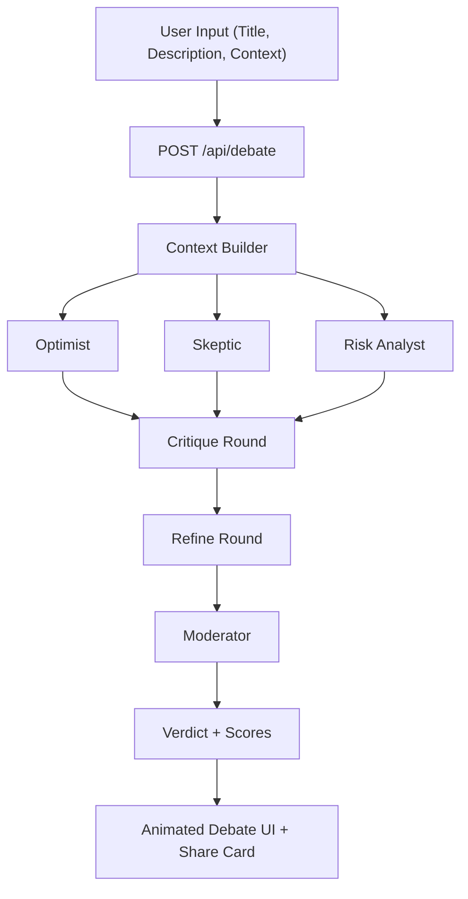

# KillMyIdea

KillMyIdea is a production-ready, Vercel-deployable web app that runs a **fast multi-agent debate** on a startup/product idea.

It simulates four roles:
- Optimist Agent
- Skeptic Agent
- Risk Analyst Agent
- Moderator Agent

The goal is short, high-signal arguments and a decisive verdict in seconds.

## Demo Flow
1. User submits idea title + description (+ optional context).
2. Backend builds a reality context (keywords, competitors, failure patterns, market signals).
3. Agents debate in 3 phases (initial, critique, refine).
4. Moderator outputs scores + verdict + actions.
5. UI animates responses as a live debate and renders a share card.


## Tech Stack
- **Framework:** Next.js 14 (App Router), React 18, TypeScript
- **Styling/UI:** TailwindCSS, lightweight shadcn-style primitives
- **Animation:** Framer Motion
- **LLM Orchestration:** LangChain (`@langchain/openai`) + custom orchestrator
- **Validation:** Zod
- **State/Memory (v1):** In-memory store
- **Deployment:** Vercel-ready

## Architecture


## Repository Structure
```text
app/
  api/
    debate/route.ts
    share-card/route.ts
  globals.css
  layout.tsx
  page.tsx
components/ui/
lib/
  debate-orchestrator.ts
  memory-store.ts
  utils.ts
types/
  debate.ts
```

## API
### `POST /api/debate`
Supports both payloads:

```json
{
  "title": "AI Resume Builder",
  "description": "Auto-generate resumes from profiles",
  "context": "Targeting students"
}
```

or compact:

```json
{
  "idea": "AI Resume Builder for students",
  "context": "Low budget market"
}
```

Response (short fields + full structured object):

```json
{
  "optimist": "...",
  "skeptic": "...",
  "risk": "...",
  "moderator": "...",
  "verdict": "Needs Pivot",
  "full": {
    "ideaName": "AI Resume Builder",
    "scores": {
      "optimist": 7,
      "skeptic": 8,
      "riskLevel": "High"
    }
  }
}
```

### `GET /api/debate`
Returns last debates from in-memory store.

### `POST /api/share-card`
Returns copy-ready share text block.

## How Orchestration Works
Core logic lives in `lib/debate-orchestrator.ts`

### 1) Context Builder
Builds reality context and injects it into all agents.

```ts
const context = await buildContext(input);
```

### 2) Parallel Initial Round
Runs Optimist, Skeptic, and Risk Analyst in parallel.

```ts
const [optimistInit, skepticInit, riskInit] = await Promise.all([
  initialRound("Optimist", optimistPrompt),
  initialRound("Skeptic", skepticPrompt),
  initialRound("Risk Analyst", riskPrompt)
]);
```

### 3) Parallel Critiques + Refinements
Each agent attacks another and then refines position.

### 4) Moderator Synthesis
Moderator outputs strict JSON:
- summary
- verdict
- optimistScore
- skepticScore
- riskLevel
- actions

## Local Development
## Prerequisites
- Node.js 18+
- npm 9+

### Setup
```bash
git clone <your-fork-url>
cd KillMyIdea
npm install
cp .env.example .env.local
```

Set at least one key:
```bash
OPENAI_API_KEY=...
OPENAI_MODEL=gpt-4o-mini
# Optional OpenAI-compatible endpoint:
OPENAI_BASE_URL=
```

### Run
```bash
npm run dev
```

### Validate
```bash
npm run lint
npm run build
```

## Deployment (Vercel)
1. Push repo to GitHub.
2. Import project into Vercel.
3. Add env vars (`OPENAI_API_KEY`, optional model/base URL vars).
4. Deploy.

## Forking & Contributing
### Fork workflow
1. Fork this repo.
2. Create feature branch: `git checkout -b feat/your-feature`.
3. Commit changes with clear messages.
4. Run lint + build locally.
5. Open PR with screenshots/GIF for UI changes.

### Contribution guidelines
- Keep debate outputs concise (3–4 sentences per message).
- Preserve strict schema contracts for API output.
- Keep UX fast; avoid blocking sequential calls when parallelization is possible.
- Add tests for orchestration/parsing changes.

### Suggested features to add
- Persistent storage (Postgres/Redis) for debate history
- Qdrant vector memory for past debate retrieval
- Public gallery page with “most controversial ideas”
- Prompt versioning and A/B testing
- Streaming responses via SSE for real-time token flow
- Agent personality sliders (aggression, optimism, risk sensitivity)
- Multi-language UI (Hindi + regional languages)
- Rate limiting and auth (Clerk/Auth.js)

## Known Limitations (v1)
- In-memory history resets on server restart.
- No auth/rate limiting yet.
- No test suite yet (recommended next step).
